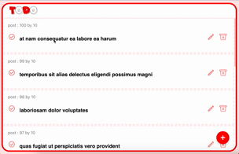

# ToDoApp
</img>

## 📌 프로젝트 개요
ToDoApp은 **리액트 복습**을 위해 개발한 투두 리스트 웹 애플리케이션입니다. **Open API**를 사용하여 pseudo 게시글 데이터를 가져와 **투두의 제목과 내용**으로 활용하며, **인피니트 스크롤 기능**을 적용하였고 데이터를 동적으로 로드할 수 있도록 구현하였습니다.

## 📅 개발 기간
**2024년 5월 16일 ~ 22일 (총 7일)**

## 🚀 주요 기능
- **인피니트 스크롤**을 활용한 동적 데이터 로딩
- **Open API**를 사용하여 게시글 데이터를 가져와 투두 리스트로 활용
- **투두 추가** 기능
- **투두 삭제, 수정, 완료(토글)** 기능

## 🛠️ 기술 스택
- **프론트엔드:** React, Context API, Hooks (`useState`, `useEffect`, `useContext`)
- **스타일링:** CSS, React Icons
- **API 통신:** Axios

## 🔧 설치 및 실행 방법
1. **프로젝트 클론**
   ```sh
   git clone https://github.com/your-repo/todoapp.git
   cd todoapp
   ```
2. **의존성 설치**
   ```sh
   npm install
   ```
3. **애플리케이션 실행**
   ```sh
   npm start
   ```
4. **웹 브라우저에서 접속**: `http://localhost:3000`

## 📌 향후 개선 사항
- JWT를 활용한 사용자 인증 기능 추가
- 데이터베이스 연동을 통한 투두 저장 기능 구현
- 사용자 프로필 및 투두 공유 기능
- 다크 모드 및 UI 개선

## 🤝 기여 방법
본 프로젝트는 개인 학습을 위한 프로젝트지만, 피드백이나 개선 제안은 언제든지 환영입니다.

